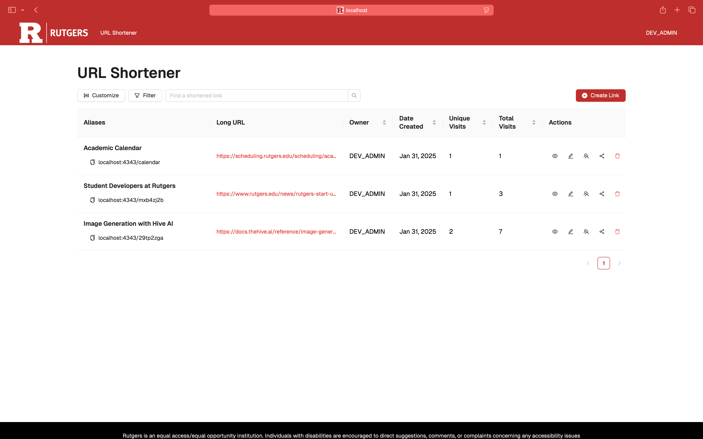

# Shrunk   

[Shrunk](https://go.rutgers.edu/) is an open-source full-stack application primarily made to shorten URLs for faculty, staff, and professors of Rutgers University. It is written in [Python](https://www.python.org/) and [TypeScript](https://www.typescriptlang.org/) and uses [MongoDB](https://www.mongodb.com/), [React](https://react.dev/), and [Flask](https://flask.palletsprojects.com/).

<div align="center">
    
</div>

## Features

- Shorten long URLs
- Create a collection of URLs onto a customizable webpage
- Supports Rutgers Central Authentication Service (CAS)
- Statistics on number of visits on a shortened URL with dynamic charts and geographic maps
- Share multiple shortened URLs via organizations
- Restricted permissions on certain actions

## Build Instructions

Click [here](./docs/build_instructions.rst) for the build instructions. You can also view the HTML version of the documentation via [GitLab Artifiacts](https://gitlab.rutgers.edu/MaCS/OSS/shrunk/-/artifacts).

## Contributing

We use [pytest](https://pytest.org) for our unit tests framework, you can run this command inside the backend directory to check if you've made regressive changes.

```
python -m pytest
```

We use [black](https://github.com/psf/black) for our backend's formatting, while using pylint, flake8, and mypy for linting in the GitLab CI/CD, you can run this command to make sure your code is up to standards. If you're using Visual Studio Code, it does this automatically.

```
black .
```

We also use [Prettier](https://prettier.io/) for our frontend's formatting, you can run this command to make sure your code is up to standards. If you're using Visual Studio Code, it does this automatically.

```
prettier --write .
```
