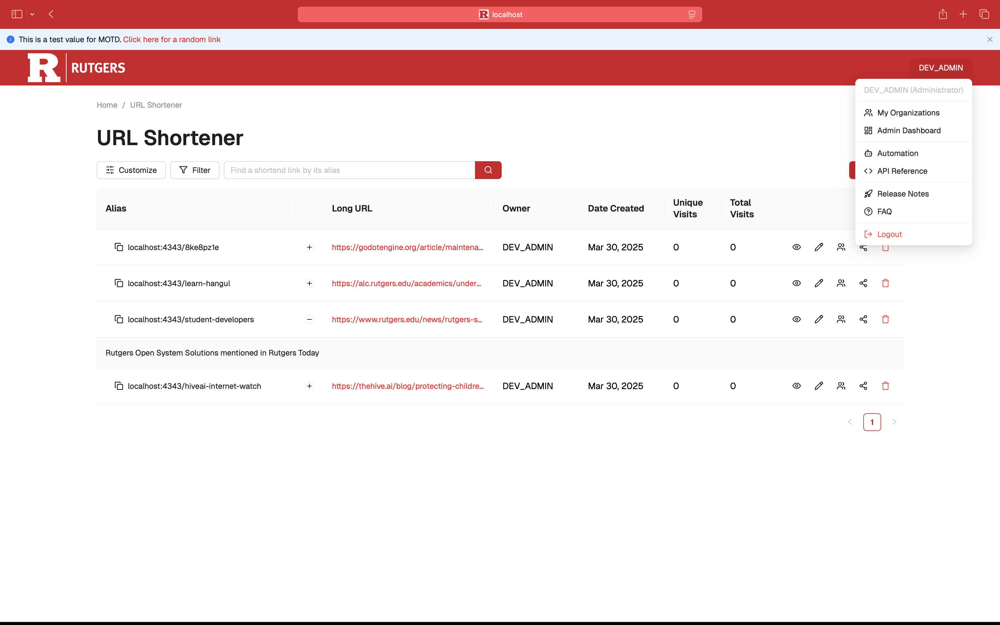

# Shrunk, the URL Shortener for Rutgers University

[Shrunk](https://go.rutgers.edu/) is an open-source full-stack application primarily made to shorten URLs for faculty and professors of Rutgers University. It is written in [Python 3.6](https://www.python.org/) and [TypeScript](https://www.typescriptlang.org/) and uses [MongoDB](https://www.mongodb.com/), [HTTPD](https://httpd.apache.org/), [React](https://react.dev/), and [Flask](https://flask.palletsprojects.com/).



## Features

- Shorten long URLs
- Create a collection of URLs onto a customizable webpage
- Supports Rutgers Central Authentication Service (CAS)
- Statistics on number of visits on a shortened URL with dynamic charts and geographic maps
- Share multiple shortened URLs via organizations
- Restricted permissions on certain actions

## Build Instructions

> [!WARNING]  
> Make sure you are connected to an outlet before running Shrunk, it will drain your laptop's battery.

1. Install or update [Docker Desktop](https://docs.docker.com/desktop/) with your Docker Engine being version 27 or newer
2. Create a copy of `.env.example` and name it `development.env`
3. Start the Docker containers

```
docker-compose up
```

5. Start developing at `http://localhost:4343` [(click to learn more about this change)](https://stackoverflow.com/questions/72369320/why-always-something-is-running-at-port-5000-on-my-mac)

### Test your code locally

This is completely optional as GitLab CI/CD should also provide you the test results.

1. Create a copy of `.env.example` and name it `test.env`
2. Set the following values
```
SHRUNK_DB_HOST="mongodb-test"
SHRUNK_DB_PORT="27018"
SHRUNK_FLASK_TESTING=1
```
3. Start the Docker containers
```
docker-compose -f docker-compose.tests.yml up
```

## Contributing

### Formatting

We use [black](https://github.com/psf/black) for our backend's formatting, while using pylint, flake8, and mypy for linting in the GitLab CI/CD, you can run this command to make sure your code is up to standards. If you're using Visual Studio Code, it does this automatically.

```
python3 -m black .
```

We also use [Prettier](https://prettier.io/) for our frontend's formatting, you can run this command to make sure your code is up to standards. If you're using Visual Studio Code, it does this automatically.

```
npx prettier --write .
```
